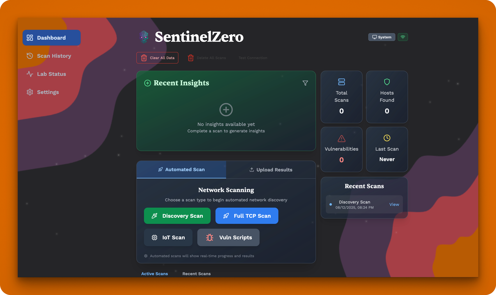
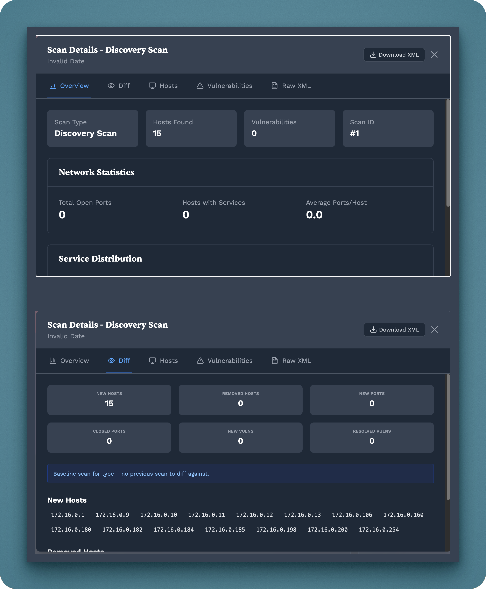
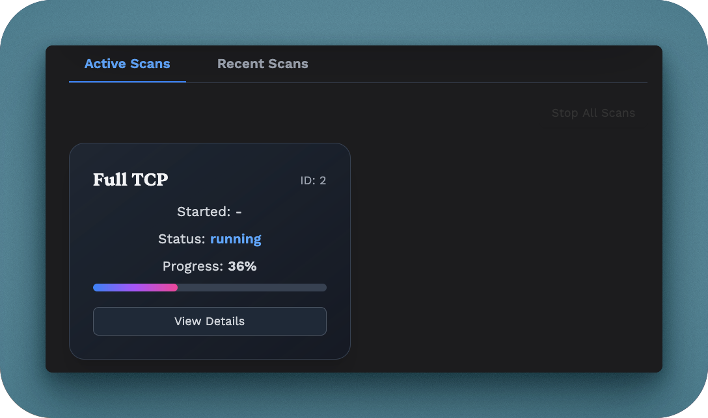
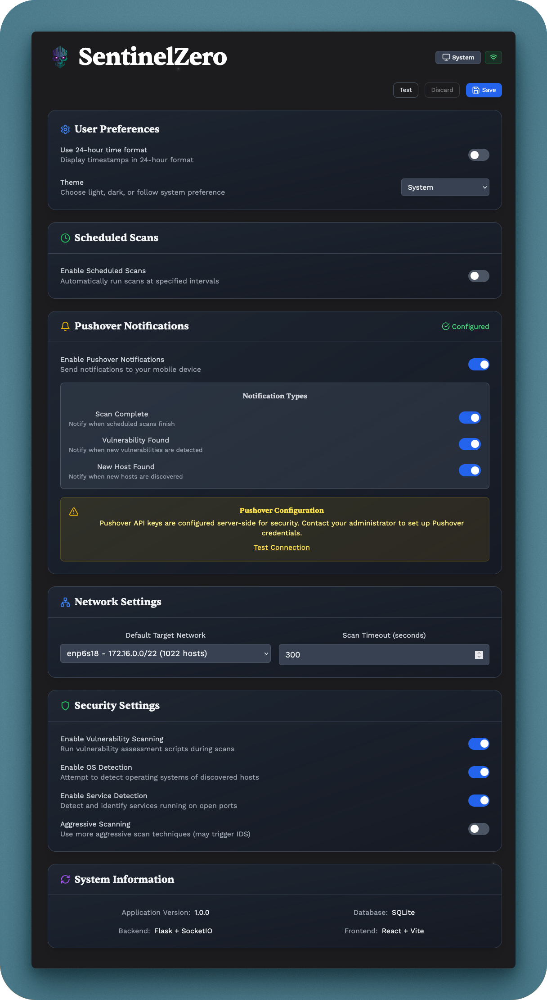
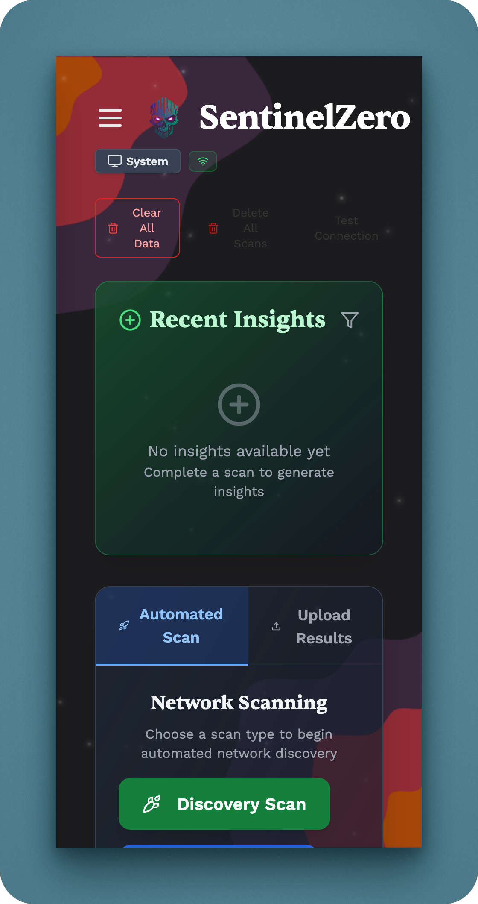

# SentinelZero

<div align="center">


**A powerful, lightweight network security scanner built for cybersecurity homelabs**

[](https://python.org)
[](https://reactjs.org)
[](https://flask.palletsprojects.com)
[](https://docker.com)

</div>

## 🎯 Overview

SentinelZero is a streamlined, browser-based network scanner that orchestrates nmap with real-time feedback, vulnerability detection, and comprehensive reporting. Purpose-built for cybersecurity professionals, penetration testers, and homelab enthusiasts who need reliable network discovery and security assessment tools.

### Key Features

- **Automated Network Scanning** - Full TCP, IoT device discovery, vulnerability scripts
- **Real-time Progress Tracking** - WebSocket-powered live scan updates
- **Manual Scan Upload** - Import XML results from external scans (ideal for macOS WiFi)
- **Comprehensive Reporting** - Host discovery, port analysis, vulnerability assessment
- **Scheduled Scans** - Automated scanning with cron-like scheduling
- **Smart Notifications** - Pushover integration for scan completion alerts
- **Modern Web Interface** - Responsive React frontend with dark theme
- **Docker Ready** - One-command deployment with Docker Compose
- **Highly Configurable** - JSON-based settings with live updates

## Quick Start

### Prerequisites

- **Docker & Docker Compose** (recommended)
- Or: **Python 3.9+** and **Node.js 18+** for local development
- **nmap** installed on the system

### Option 1: Docker Deployment (Recommended)

```bash
# Clone the repository
git clone https://github.com/your-username/SentinelZero.git
cd SentinelZero

# Deploy with Docker
./deploy.sh
```

Access the application at **http://localhost:5001**

### Option 2: Local Development

```bash
# Backend setup
cd backend
uv sync                    # Install Python dependencies
uv run python app.py       # Start Flask server

# Frontend setup (new terminal)
cd frontend/react-sentinelzero
npm install                # Install Node dependencies
npm run dev                # Start Vite dev server
```

Access the development server at **http://localhost:5173**

## Project Structure

```
SentinelZero/
├── backend/                    # Flask API server
│   ├── src/                   # Modular backend architecture
│   │   ├── models/           # Database models (SQLAlchemy)
│   │   ├── routes/           # API endpoints (Flask Blueprints)
│   │   ├── services/         # Business logic (scanning, notifications)
│   │   └── utils/            # Helper utilities
│   ├── app.py                # Main Flask application
│   └── requirements.txt      # Python dependencies
├── frontend/                   # React web interface
│   └── react-sentinelzero/   # Vite + React app
│       ├── src/              # React components and pages
│       └── package.json      # Node.js dependencies
├── docker-compose.yml         # Docker deployment configuration
├── Dockerfile                 # Multi-stage Docker build
└── *.json                     # Configuration files
```

## Configuration

SentinelZero uses JSON configuration files for flexible setup:

- **`network_settings.json`** - Target networks, scan parameters
- **`security_settings.json`** - Scan types, OS detection, service discovery
- **`notification_settings.json`** - Pushover integration settings
- **`scheduled_scans_settings.json`** - Automated scan scheduling

All settings can be modified through the web interface or by editing files directly.

## Scan Types

| Scan Type | Description | Use Case |
|-----------|-------------|----------|
| **Full TCP** | Comprehensive port scan with OS/service detection | Complete network assessment |
| **IoT Scan** | Specialized scan for IoT devices and embedded systems | Smart home/industrial networks |
| **Vuln Scripts** | Vulnerability detection using nmap scripts | Security assessment |
| **Discovery Scan** | Fast host discovery without port scanning | Network mapping |
| **Manual Upload** | Import XML from external scans | macOS WiFi, privileged scans |

## Screenshots

### Dashboard Overview

<sub><i>Main dashboard showing scan controls, recent scans, and system statistics</i></sub>

### Scan Results

<sub><i>Detailed scan results with host discovery, open ports, and vulnerability findings</i></sub>

### Real-time Progress

<sub><i>Live scan progress with WebSocket updates and status tracking</i></sub>

### Settings Configuration

<sub><i>Network configuration, scan parameters, and notification settings</i></sub>

### Mobile View



<sub><i>Responsive design for mobile and tablet</i></sub>

---

## Development

### Backend Development

```bash
cd backend

# Install development tools
uv sync

# Run tests
uv run pytest

# Code formatting
uv run black .

# Linting
uv run flake8 .
```

### Frontend Development

```bash
cd frontend/react-sentinelzero

# Install dependencies
npm install

# Start development server
npm run dev

# Build for production
npm run build

# Run linting
npm run lint
```

### Testing

```bash
# Backend tests
cd backend && uv run pytest

# Frontend tests (Playwright)
cd frontend/react-sentinelzero && npm run test
```

## Docker Deployment

SentinelZero includes production-ready Docker configuration:

```yaml
# docker-compose.yml highlights
services:
  sentinelzero:
    build: .
    ports: ["5001:5001"]
    cap_add: [NET_ADMIN, NET_RAW]  # Required for network scanning
    volumes:
      - ./data/scans:/app/scans     # Persistent scan results
      - ./data/database:/app/instance  # Database storage
```

## Network Considerations

### macOS WiFi Limitations

Due to macOS System Integrity Protection (SIP), raw socket access over WiFi interfaces is restricted. SentinelZero provides two solutions:

1. **Manual Upload**: Run scans in terminal, upload XML results
2. **Ethernet Connection**: Use wired connection for automated scanning

### Network Scanning Capabilities

- **Host Discovery**: Ping sweeps, ARP discovery
- **Port Scanning**: TCP SYN, connect scans
- **Service Detection**: Version detection, OS fingerprinting  
- **Vulnerability Assessment**: NSE script integration

## Documentation

- **[Backend Architecture](backend/src/README.md)** - Detailed backend structure and API
- **[Backend Setup](backend/README.md)** - Installation and development guide
- **[Testing Guide](backend/tests/README.md)** - Test suite documentation
- **[Deployment Guide](DEPLOYMENT.md)** - Production deployment instructions
- **[Migration Guide](UV_MIGRATION.md)** - Package manager migration notes

## Security

- **Capability-based Security**: Minimal privileges with CAP_NET_ADMIN/CAP_NET_RAW
- **Input Validation**: All user inputs sanitized and validated
- **Network Isolation**: Docker network isolation for containers
- **No Root Required**: Runs as non-root user (except for specific network operations)

## Contributing

1. Fork the repository
2. Create a feature branch (`git checkout -b feature/amazing-feature`)
3. Commit your changes (`git commit -m 'Add amazing feature'`)
4. Push to the branch (`git push origin feature/amazing-feature`)
5. Open a Pull Request

## License

This project is licensed under the MIT License - see the [LICENSE](LICENSE) file for details.

## Acknowledgments

- **nmap** - The backbone of network scanning
- **Flask** - Lightweight web framework
- **React** - Modern frontend library
- **Lucide React** - Beautiful icon library
- **Socket.IO** - Real-time bidirectional event-based communication

## Support

- **Bug Reports**: [GitHub Issues](https://github.com/your-username/SentinelZero/issues)
- **Discussions**: [GitHub Discussions](https://github.com/your-username/SentinelZero/discussions)
- **Documentation**: Check the linked documentation above

---

<div align="center">

**Purpose-built for cybersecurity practitioners and homelabbers**

[⭐ Star this project](https://github.com/your-username/SentinelZero) if you find it useful!

</div>
