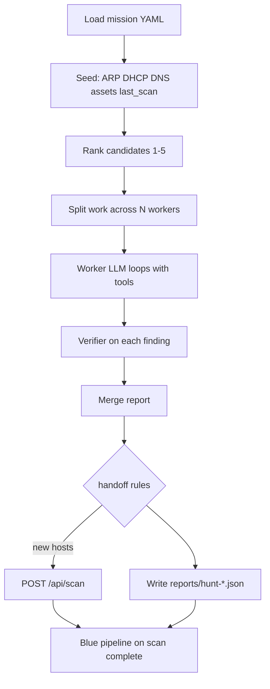

# Hunter Agent — Pre-Implementation Plan

**Status:** Pre-plan (not yet implemented)  
**Author context:** Derived from May 2026 SentinelZero sessions (scan/sensor discrepancy analysis, Mythos
scaffold discussion, placement on palindrome vs wired nodes).  
**Goal:** Build a **red-team-style hunter** that feeds SentinelZero’s **blue** pipeline — it does **not**
replace `agent.py` verdicts or post-scan insights.

---

## 1. Problem statement

SentinelZero today is strong **after** a scan completes:

```text
nmap scan → insights.py → agent.py --insights (verdicts) → UI
```

What is missing is an **upstream, autonomous enumerator** that:

- Correlates **passive** inventory (sensors, DHCP, ARP, Pi-hole clients, asset registry) with **active**
  scan results.
- Finds **gaps** (hosts sensors see but scans miss; registry hosts absent from scans).
- Runs **targeted probes** before triggering a full SentinelZero scan.
- Hands off **structured findings + scan requests** so the existing blue pipeline can triage them.

This is intentionally modeled on Anthropic’s **Mythos scaffold** (see
[red.anthropic.com/2026/mythos-preview/](https://red.anthropic.com/2026/mythos-preview/)): not “a
smarter nmap wrapper,” but a **long-horizon agent loop** with seed → rank → parallel workers → verifier
→ handoff — while SentinelZero stays the SOC analyst.

---

## 2. Blue vs Hunter — hard boundary

| | **Blue (`agent.py`)** | **Hunter (new)** |
|---|------------------------|------------------|
| **Trigger** | Post-scan (`--insights`, `--latest`, timer) | Mission timer or manual `--mission` |
| **Job** | Verdict on a **known** insight | Hunt: inventory gaps, unknown hosts, exposure |
| **Tools** | Scan diff, sensors (read), asset context | Sensors (read) + **allowlisted probes** + handoff |
| **Output** | `verdict`, `verdict_summary`, patches `insights_json` | Hunt report JSON; optional `POST /api/scan` |
| **LLM role** | Analyst — dismiss / explain / escalate | Investigator — gather evidence, no verdicts |
| **Max turns** | ~10 | ~40+ (configurable per mission) |

**Rule:** Hunter never calls `--insights`, never patches verdicts, never merges into `agent_service.py`.
It creates **work** (new scan data, reports); blue consumes that work automatically on the next scan
cycle.

---

## 3. Context from production — why this matters

### 3.1 Scan vs sensor vs live network (Lab, May 2026)

| Source | Lab host count (typical) |
|--------|---------------------------|
| Scan #1 (Full TCP, pre-discovery ON) | **9** |
| Live `nmap -sn` on lab /22 | **10** (included `172.16.0.100` winvm) |
| Asset registry (`assets.json`) | **12** lab IPs (some intentionally offline) |
| Pi-hole / OPNsense passive | More DNS/ARP clients over time |

**Root causes identified:**

1. **`pre_discovery_enabled`** narrowed Full TCP to the pre-discovery host list only. A host down
   during pre-discovery (e.g. winvm booting ~00:49 during scan window) was **never port-scanned**.
   → Fixed: `pre_discovery_enabled: false` in `network_settings.json` (committed `f1d339e`).

2. **Timing / reboot window** — yin, yang, pihole, OPNsense showed lastboot ~2 min after scan start;
   winvm likely offline during pre-discovery, up later.

3. **East-west lab traffic** often does not hit OPNsense firewall logs; IDS on LAN may still see SYN
   sweeps from scanner sources `172.16.0.198` / `172.16.0.254`.

4. **Insights** only flagged `sensor_gap` (9 hosts without endpoint sensors) — no
   `inventory_gap`-style signal until backend added `hosts_for_inventory_gap()` (committed `f1d339e`).

Discovery Scan #2 after fixes: **10 hosts** (winvm present).

**Hunter implication:** Seed phase should **diff sensors + registry vs last scan** *before* any LLM
loop, and recommend targets for SentinelZero scans — exactly the gap the hunter closes.

### 3.2 Sensor DB reset / ingest 404

After backend DB rebuild, `sensor_agent` was empty while systemd sensors still ran. Ingest returned
404 `"agent not registered"` and telemetry was dropped.

**Fixes shipped (committed `f1d339e`):**

- Backend **auto-register on ingest** (`_upsert_sensor_agent` in `sensor_routes.py`).
- Network sensors: shared `sensor_reporter.py` with retry register + periodic re-register.
- Endpoint `reporter.py`: same pattern.
- Systemd `ExecStartPre=wait-for-backend.sh` on network sensor units.

**Hunter implication:** Hunter reads sensors via API; depends on healthy ingest. Monitor
`GET /api/sensor/agents` (expect 8 agents when all running).

### 3.3 Home / IoT scans and ARP

- **Skipping ARP on Home is correct** — lab host is not L2-adjacent to `192.168.68.0/22`; ARP cannot
  cross OPNsense to home devices.
- **IoT Scan** uses `-Pn` + UDP ports; does not use ARP. Weakness for home IoT is **probe choice**
  (ICMP/TCP discovery misses ping-silent IoT) and **UDP `open|filtered` dropped** in XML parser — not
  missing ARP.
- Home scans from sentinelzero are **routed** Lab → OPNsense WAN → home; OPNsense rules must allow
  **UDP 1900/5353** etc. on LAN-in / WAN-out.

**Hunter implication:** Home missions must run **probes from a wired home executor**, not from palindrome
Wi‑Fi or routed lab nmap alone.

---

## 4. Mythos scaffold → Hunter phases

Anthropic’s pattern (simplified):

| Mythos | Hunter equivalent |
|--------|-------------------|
| Isolated container + target source | Scope-limited executor + allowed CIDRs |
| Prompt: “find a vulnerability” | Mission YAML: objective + `target_network` |
| Read → hypothesize → run → debug | Seed → rank → worker LLM loop → probe tools |
| Parallel per **file** | Parallel per **host** or **/28 slice** |
| Rank files 1–5 | Rank candidates (ARP unknown, registry gap, stale scan, …) |
| Verifier agent | Second pass: real finding vs noise |
| Optional exploit PoC prompt | Phase 2: `assess` profile — deep port/NSE on flagged hosts only |

We do **not** need Mythos-the-model. We need Mythos-the-**workflow** with local Ollama
(`qwen2.5:14b` on palindrome).

---

## 5. Placement architecture (decided)

Three jobs **split across boxes**:

| Job | Where | Why |
|-----|--------|-----|
| **Ollama (LLM)** | **palindrome** `192.168.68.202:11434` | GPU/dev box; already validated from lab (`ufw` opened). Remote HTTP is fine — latency ≪ nmap runtime. |
| **Hunter controller** | **sentinelzero** | Wired lab L2; SentinelZero API localhost; sensor aggregation. |
| **Lab probes** | **local on sentinelzero** | On-link ARP/ICMP/TCP for `172.16.0.0/22`. |
| **Home probes** | **SSH executor on wired home node** | Avoid palindrome Wi‑Fi flakiness and double-hop routed scans. |

### 5.1 Why not run the whole hunter on palindrome?

palindrome is on **Wi‑Fi** (home). That causes:

- Hosts flapping up/down between probes (observed with winvm timing).
- Less reliable ARP/ICMP for discovery-style work.
- Noisy IDS/ntopng patterns.

palindrome remains ideal for **Ollama** and interactive dev; not for authoritative **home** probes.

### 5.2 Home wired executor (day one)

**Primary candidate:** `ubuntu-server` — `192.168.71.30` (assets.json: linux-server, wired home
segment).

**Alternate:** `pihole-home` — `192.168.71.25` (Pi-hole; already has endpoint sensor — prefer not to
load with heavy nmap unless necessary).

**Mechanism:**

```text
hunter on sentinelzero
  → discover_hosts(home): ssh root@192.168.71.30 'nmap -sn ...'
  → port_scan_light(ip):   ssh ... 'nmap -sV --open ...'
```

Requirements before first home mission:

- Passwordless SSH (key) from `sentinel`@sentinelzero → root@192.168.71.30
- `nmap` installed on ubuntu-server
- OPNsense: allow SSH from lab to home if not already (inter-VLAN)
- Document executor in mission YAML: `executor: ssh://root@192.168.71.30`

**Lab executor:** `local` (no SSH) — sentinelzero runs nmap directly.

### 5.3 Ollama exposure

Keep on palindrome:

```bash
OLLAMA_BASE_URL=http://192.168.68.202:11434/v1
OLLAMA_MODEL=qwen2.5:14b
# Optional: OLLAMA_EMBED_MODEL=nomic-embed-text for hunter incident recall
```

Firewall on palindrome: allow `11434/tcp` from `172.16.0.0/22` only (plus localhost).

Do **not** move Ollama to sentinelzero unless GPU is added there.

---

## 6. Network topology reference

```text
Internet ← home router 192.168.68.1 ← OPNsense WAN ← Lab 172.16.0.0/22
                                              ↑
                                         sentinelzero
                                         (172.16.0.198 DHCP, 172.16.0.254 VIP)
```

| Network | CIDR | Gateway | DNS | Hunter executor |
|---------|------|---------|-----|-----------------|
| Lab | `172.16.0.0/22` | 172.16.0.1 | 172.16.0.13 | **local** (sentinelzero) |
| Home | `192.168.68.0/22` | 192.168.68.1 | 192.168.71.25 | **ssh** → 192.168.71.30 |

Scanner probe sets (mirror `scanner.py`):

- **On-link (lab):** `-PE -PP -PM -PR -PS22,80,443,3389,8080 -PA80,443`
- **Routed (home):** `-PE -PP -PS22,80,443,3389,8080 -PA80,443` (no ARP/PM)

---

## 7. Repository layout (agent codebase — not in SentinelZero git yet)

Planned under `/home/sentinel/agent/` (same venv as `agent.py`; **separate** from SentinelZero repo):

```text
/home/sentinel/agent/
  agent.py                 # blue — unchanged role
  hunter.py                # CLI entry
  hunter/
    __init__.py
    loop.py                # tool-calling loop (fork analyze() pattern)
    tools.py               # dispatch + scope checks + executors
    seed.py                # passive inventory merge
    rank.py                # score candidates 1–5
    verify.py              # verifier LLM pass
    handoff.py             # report JSON + POST /api/scan
    executors/
      local.py             # subprocess nmap on sentinelzero
      ssh.py               # remote nmap via ssh
    missions/
      lab_inventory.yaml
      home_inventory.yaml
  reports/                 # gitignored hunt output
  context/
    assets.json            # shared with blue
    network.json           # shared with blue
```

SentinelZero repo (optional later):

```text
backend/src/routes/hunter_routes.py   # phase 2: POST /api/hunter/reports
frontend — Hunt history tab           # phase 3
```

---

## 8. Mission config format

```yaml
# missions/lab_inventory.yaml
id: lab_inventory
objective: >
  Build authoritative lab host inventory. Prioritize IPs seen in OPNsense ARP or DHCP
  but missing from the asset registry or the latest SentinelZero scan. Gather evidence;
  do not assign verdicts. Do not run destructive tests.
target_network: 172.16.0.0/22
profile: white          # white | assess (phase 2)
executor: local
max_turns: 40
parallel_workers: 4
handoff:
  trigger_discovery_scan: true
  scan_type: "Discovery Scan"
  min_new_hosts: 1
scope:
  allowed_cidrs:
    - 172.16.0.0/22
```

```yaml
# missions/home_inventory.yaml
id: home_inventory
objective: >
  Enumerate home network hosts. Prioritize Pi-hole top clients and unknowns vs assets.json.
  Use wired executor only. Flag IoT-relevant UDP exposure for follow-up IoT Scan.
target_network: 192.168.68.0/22
profile: white
executor: ssh://root@192.168.71.30
max_turns: 40
parallel_workers: 2
handoff:
  trigger_discovery_scan: true
  scan_type: "Discovery Scan"
  min_new_hosts: 1
scope:
  allowed_cidrs:
    - 192.168.68.0/22
    - 192.168.71.0/24
```

Profiles:

| Profile | Allowed tools |
|---------|----------------|
| **white** | Sensors, seed/rank, `discover_hosts`, `port_scan_light`, handoff |
| **assess** | + targeted `-sV`, IoT UDP on **flagged IPs only** (phase 2) |

---

## 9. Tool surface (hunter-only)

### 9.1 Read tools (reuse from `agent.py` patterns)

| Tool | Source |
|------|--------|
| `get_network_topology()` | `context/network.json` |
| `get_asset_context(ip)` | `context/assets.json` |
| `get_network_context(source)` | `GET /api/sensor/latest/{opnsense\|pihole-lab\|pihole-home\|opnsense-ntopng}` |
| `get_sensor_agents()` | `GET /api/sensor/agents` |
| `get_latest_scan_hosts(network)` | `GET /api/scans` + parse hosts for matching `target_network` |

### 9.2 Action tools (allowlisted — no raw shell to LLM)

| Tool | Behavior |
|------|----------|
| `discover_hosts(cidr)` | `nmap -sn` + on-link/routed probes via mission executor |
| `port_scan_light(ip)` | `nmap -sV --open -T4` (single host) |
| `port_scan_iot(ip)` | Phase 2; UDP port set from scanner IoT profile |
| `submit_finding(dict)` | Append to in-run report buffer |
| `request_scan(scan_type, cidr)` | `POST /api/scan` (Discovery / Full TCP / IoT Scan) |

Executor selection:

```python
if mission.executor == "local":
    run_local_nmap(argv)
elif mission.executor.startswith("ssh://"):
    run_ssh_nmap(mission.executor, argv)
```

Every probe validates `ip in allowed_cidrs` before execution.

### 9.3 Handoff tools

| Tool | Behavior |
|------|----------|
| `finalize_hunt_report()` | Write `reports/hunt-{mission_id}-{iso}.json` |
| Optional phase 2 | `POST /api/hunter/reports` |
| Optional | `POST /api/incidents` with `source=hunter` + embedding for recall |

---

## 10. Hunt pipeline (single run)



### 10.1 Seed (deterministic, no LLM)

Inputs:

- OPNsense: `arp_table`, `dhcp_leases` (`get_network_context('opnsense')`)
- Pi-hole: `top_clients` (lab or home sensor by mission)
- `assets.json` keys in scope
- Latest completed scan hosts for `target_network`

Compute:

- **unknown_in_passive** = (ARP ∪ DHCP ∪ DNS clients) − registry
- **missing_from_scan** = registry − last_scan_hosts (reuse `hosts_for_inventory_gap` logic)
- **stale** = registry hosts not seen in scan within N days

### 10.2 Rank (rules-first v1)

| Score | Signal |
|-------|--------|
| 5 | Passive seen, not in registry, probe confirms up |
| 4 | In registry, missing from last scan |
| 3 | Pi-hole client, never in any scan |
| 2 | Known host, scan older than 7 days |
| 1 | Default |

Optional: one cheap LLM call to reorder top 20 using `network.json` known_unknowns.

### 10.3 Worker loops

- System prompt: **hunter, not analyst** — gather evidence, use `submit_finding`, never verdict.
- `max_turns` per worker: 15–25; mission `max_turns` is global budget.
- Model: `_make_client()` + `_model_for()` from shared agent seam; Ollama on palindrome.

### 10.4 Verifier

For each finding:

- Drop: expected offline VM (assets notes), duplicate of last scan, DHCP transient.
- Keep: new host with MAC, registry gap with probe evidence.

Implementation: short second LLM call or rule engine for v1.

### 10.5 Handoff report schema

```json
{
  "mission_id": "lab_inventory",
  "target_network": "172.16.0.0/22",
  "executor": "local",
  "completed_at": "2026-05-30T12:00:00Z",
  "seed_summary": {
    "arp_hosts": 11,
    "registry_hosts": 12,
    "last_scan_hosts": 10,
    "last_scan_id": 2
  },
  "findings": [
    {
      "type": "missing_from_scan",
      "ip": "172.16.0.106",
      "display_name": "code-server.prox",
      "evidence": ["in assets.json", "absent from scan #2", "offline per assets note"],
      "recommended_action": "none_until_online"
    }
  ],
  "hosts_recommended_for_scan": ["172.16.0.100"],
  "scan_triggered": {
    "scan_id": 3,
    "scan_type": "Discovery Scan"
  },
  "worker_summaries": ["..."]
}
```

Phase 1 handoff **does not** need new backend routes — file on disk + optional scan trigger is enough.
Blue agent runs automatically when scan completes.

---

## 11. CLI and systemd

```bash
# One-shot
/home/sentinel/agent/.venv/bin/python /home/sentinel/agent/hunter.py \
  --mission lab_inventory -v

/home/sentinel/agent/.venv/bin/python /home/sentinel/agent/hunter.py \
  --mission home_inventory -v

# Dry run
python hunter.py --mission lab_inventory --seed-only

# No scan trigger
python hunter.py --mission lab_inventory --no-trigger-scan
```

Environment (`/etc/sentinel-hunter/agent.env`):

```bash
SENTINELZERO_URL=http://172.16.0.254:5000
SENSOR_API_KEY=...
OLLAMA_BASE_URL=http://192.168.68.202:11434/v1
OLLAMA_MODEL=qwen2.5:14b
HUNTER_SSH_HOME=root@192.168.71.30
HUNTER_REPORTS_DIR=/home/sentinel/agent/reports
```

Systemd (planned):

```text
sentinel-hunter.timer
  → hunter.py --mission lab_inventory
  → (separate timer or staggered) hunter.py --mission home_inventory
```

Distinct from `sentinel-agent.timer` (blue `--latest`).

---

## 12. OPNsense / firewall notes for hunter

When debugging blocked probes, watch on OPNsense:

| Mission | Interface / direction |
|---------|------------------------|
| Lab local probes | Often **no firewall log** for east-west; IDS on LAN for SYN from `.198`/`.254` |
| Home via SSH executor | Traffic **within home L2** — home router/OPNsense may not see it |
| Home scan from lab (avoid) | LAN **in** from scanner → WAN **out** to `192.168.68.0/22` |
| SSH lab → ubuntu-server | Allow 22 from `172.16.0.0/22` to `192.168.71.30` |

Suppress or whitelist Suricata SID **2003068** (SSH scan) for sentinelzero scanner IPs — documented in
`network.json` known_unknowns for `172.16.0.198`.

---

## 13. Implementation phases

### Phase 1 — MVP (target next sprint)

- [ ] `hunter/seed.py`, `rank.py` — deterministic; unit-testable without LLM
- [ ] `hunter/executors/local.py`, `executors/ssh.py`
- [ ] `hunter/tools.py` — read tools + discover + light port scan + scope guard
- [ ] `hunter/loop.py` + `hunter.py` CLI
- [ ] `missions/lab_inventory.yaml`, `missions/home_inventory.yaml`
- [ ] `hunter/handoff.py` — JSON report + `POST /api/scan`
- [ ] SSH key: sentinelzero → root@192.168.71.30
- [ ] `sentinel-hunter.service` + timer (lab daily, home daily staggered)
- [ ] Manual validation: home mission finds Pi-hole clients; lab mission diffs ARP vs scan #2

**Success criteria:** Hunt report lists at least one justified `hosts_recommended_for_scan`; triggered
Discovery Scan produces new scan row; blue `--insights` runs unchanged on that scan.

### Phase 2 — Verifier + assess profile

- [ ] `verify.py` LLM pass
- [ ] `profile: assess` with IoT UDP / `-sV` on flagged hosts only
- [ ] Parallel workers (thread pool per mission)

### Phase 3 — SentinelZero integration

- [ ] `POST /api/hunter/reports` + DB model `hunt_report`
- [ ] UI: Hunt history linked to `scan_id`
- [ ] `source=hunter` incident embeddings for blue agent recall

---

## 14. Shared code with blue agent

Extract (optional refactor when implementing):

| Module | Shared |
|--------|--------|
| `_make_client`, `_model_for`, `_chat_create` | `agent/llm.py` or import from `agent.py` |
| `_http`, `BASE_URL`, `API_KEY` | `agent/client.py` |
| Asset/network context loaders | already in `agent.py` — import, don’t duplicate |

Do **not** merge hunter tools into `TOOL_SCHEMAS` in `agent.py`.

---

## 15. Related commits (SentinelZero repo)

| Commit | Summary |
|--------|---------|
| `a4f023a` | LLM pipeline Phases 1–7, local Ollama, incident memory |
| `f1d339e` | Pre-discovery off, 3389 probes, `inventory_gap`, sensor auto-register on ingest |

Agent-side sensor reporter changes live in `/home/sentinel/agent/` (not yet a separate git repo).

---

## 16. Open questions

1. Confirm **ubuntu-server** (`192.168.71.30`) as home SSH executor vs pihole-home.
2. Stagger home vs lab hunt timers to avoid overlapping Ollama load on palindrome.
3. Whether hunter reports should appear in UI before phase 3 (file-only OK initially).
4. Wire palindrome later → could add optional local home executor override; lab stays on sentinelzero.

---

## 17. References

- Anthropic Mythos scaffold: https://red.anthropic.com/2026/mythos-preview/
- SentinelZero handoff: `HANDOFF.md`
- Agent blue pipeline: `/home/sentinel/agent/agent.py`
- Scanner probe logic: `backend/src/services/scanner.py`
- Asset registry: `/home/sentinel/agent/context/assets.json`
- Topology: `/home/sentinel/agent/context/network.json`
